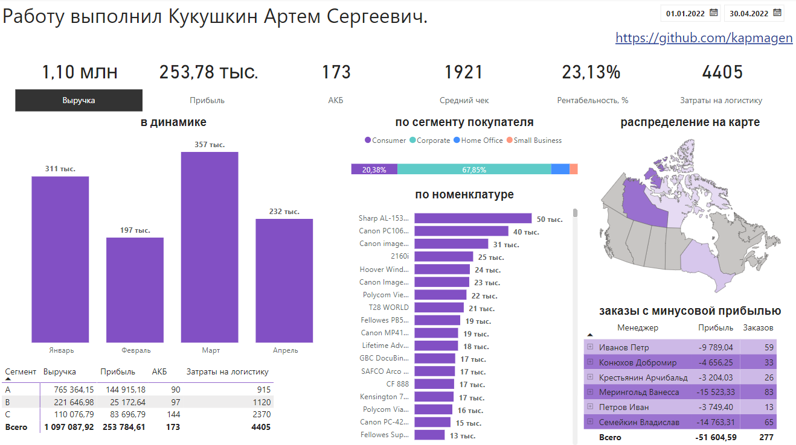
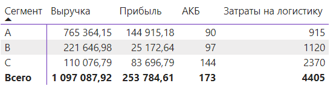
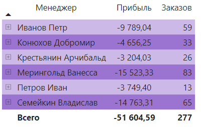
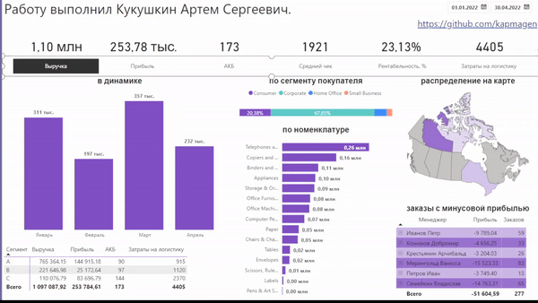

# Аналитика продаж в Power BI: построение эффективного отчета

## Описание проекта
Этот проект позволяет максимально наглядно ознакомиться с аналитикой продаж. Он не только собирает и обрабатывает данные о доходах, издержках и эффективности продаж, но и визуализирует их в наглядных отчетах. Вы сможете увидеть, как меняются и различаются продажи в зависимости от времени, места, товара и менеджера. Вы также сможете определить, какие товары являются самыми востребованными, прибыльными и затратными. Этот проект даст вам полную картину ситуации на основе данных, такая работа поможет вам принять правильные решения для развития и определения точек роста.

## Структура репозитория
- `data/` - содержит данные, использованные для анализа в Power BI
- `images/` - содержит изображения, используемые в README.md
- `Аналитика продаж.pbix` - файл Power BI Desktop, который содержит отчет о продажах
- `README.md` - файл, который вы сейчас читаете

## ABC-наменклатура
Создание сегментов продукта на основе двух мер и кастомизации некоторых столбцов позволило легко получить ABC-наменклатуру. Я использовал матрицу в Power BI для более удобного представления данных. 

## Менеджеры, продавшие товары с отрицательной прибылью
Просчет визуализации для менеджеров, продавших товары с отрицательной прибылью, был одним из наиболее интересных вызовов в этом проекте. Особенность структуры данных добавила трудности для выполнения данной визуализации, тем не менее, все получилось прекрасно и наглядно.

## Срез, регулирующий меры на графике
Создание этой фичи моя любимая часть проекта. Этот срез является улучшением пользовательского опыта. Размещение среза в верхней части отчета позволяет менять значения на графиках, давая им больше контроля над данными.

Остальные части отчета были также подробно проработаны и включают множество полезных графиков и таблиц для улучшения продаж. Ознакомьтесь с самим проектом, чтобы получить дополнительную информацию.
